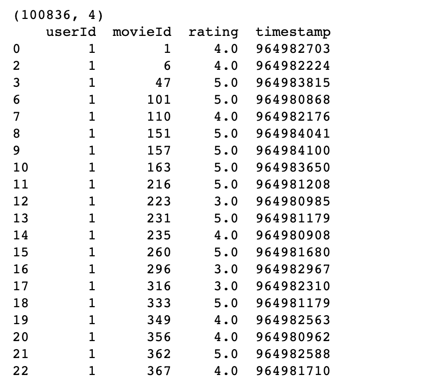
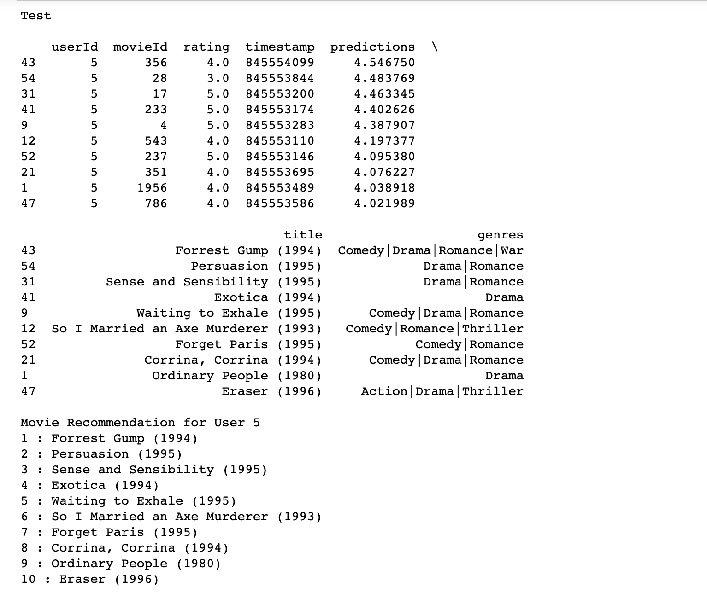

# [딥러닝] MovieLens 데이터를 활용한 영화 개인화 추천

This project is implementation of Deep Learning Movie Recommendation Model. This is a very simple Deep Learning model for recommending user's preferring movies without any front-end. This project is simply to study how to build up deep learning neuron layers using some deep learning modules in Pytorch. The basic code and model reference is [here](https://github.com/yanneta/pytorch-tutorials). 


### Prerequisites

```
python 3.7.3

conda 4.8.1

torch 1.3.1

jupyter notebook
```


### Technologies Used

###### Machine Learning Library in Python

Numpy, Pandas, pathlib


### Data Used

Train, Validation, and Test datas are all from Movielens database. [here](https://grouplens.org/datasets/movielens/)

Any files can be used, but when the model is trained in CPU-only environment, the *ml-latest-smallest.zip* data file is trainable. 

>  100,000 ratings and 3,600 tag applications applied to 9,000 movies by 600 users.


###### Screenshot of the Data used

Data files are in .csv files

*  'ratings.csv' file is used for traing and testing.
* 'movies.csv' file is used to get movie name for movie ID in the end when movies are recommended. 


**Data in 'ratings.csv':**



**Data in 'movies.csv':**


### Getting Started

1. Git clone following project

```
$ git clone https://github.com/yjksw/DeepLearning_Movie_Recommendation_System
```

2. Download data from [Movielens](https://grouplens.org/datasets/movielens/)
   * Download <mark>ml-latest-smallest.zip</mark> for fast training
3. Open jupyter notebook
4. Start following .ipynb file 


### Result

###### Train and validation result: 


###### Test result: 



